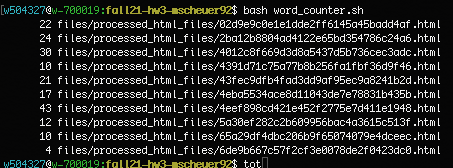
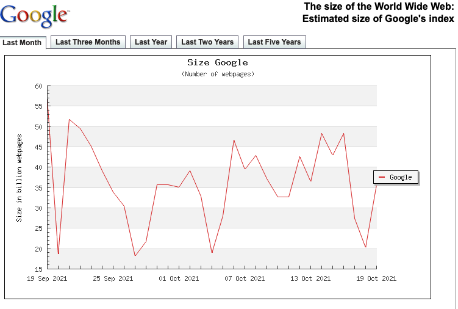

### Data Collection

#### Saving the HTML Files

To save the HTML files, I wrote `data-collection.py`. Let's take a look at that script:

```python
#data_collection.py

# Michelle Scheuer
# 10/13/2021

import os
import time
import subprocess as sp

uri_file = open("files/uniqueURI.txt", "r")
content = uri_file.readlines()
lines = [line.rstrip() for line in content]


for link in lines:
    output = sp.getoutput("echo -n" + link + " | md5 | sed s/$/.html/ | awk '{print $1}'")
    time.sleep(5)
    os.popen("curl " + link + " > " + output + " | mv " + output + " files/raw_html_files")

```
This script reads in `uniqueURI.txt` (the file that I had saved previously saved my 1000 unique URI's).

From there, the script:
* Saves each of the URI-R's to a list.
* Each link in the list passes through the `for loop` for processing. 
  * I've created the `output` variable to store the value of subprocess 
    `"echo -n" + link + " | md5 | sed s/$/.html/ | awk '{print $1}'`
      * In order to get unique names, each link will be hashed using `md5`. Additionally, I've piped `sed s/$/.html/`
      to give the link the proper extension.
  * I then call ` os.popen("curl " + link + " > " + output + " | mv " + output + " files/raw_html_files")` 
    * This command curls the link and saves it to the hashed output. 
    * I also piped in a `mv` command for housekeeping.
  
    
#### Removing HTML Boilerplate

In order to remove the HTML boilerplate, I wrote `boilerplate_remover.py`, as seen below:

```python 
#boilerplate_remover.py

# Michelle Scheuer
# 10/13/2021

import time
from boilerpy3 import extractors
import os
import codecs

extractor = extractors.ArticleExtractor()

for a in os.listdir("files/raw_html_files"):
    # lines 70-74 borrowed from https://stackoverflow.com/questions/3269293/how-to-write-a-check-in-python-to-see-if-file-is-valid-utf-8
    try: 
        f = codecs.open("files/raw_html_files/" + a, encoding='utf-8', errors='ignore')
        for line in f:
            pass
    except UnicodeDecodeError:
        os.popen("mv files/raw_html_files/" + a + " files/processed_no_useful_text | rm  files/raw_html_files/" + a)

    filesize = os.path.getsize("files/raw_html_files/" + a)
    if filesize == 0:
        os.popen("mv files/raw_html_files/" + a + " files/processed_no_useful_text | rm  files/raw_html_files/" + a)
        time.sleep(2)
    else:
        content = extractor.get_content_from_file("files/raw_html_files/" + a)
        os.popen("touch " + a + "| rm  files/raw_html_files/" + a)
        file = open(a, "w")
        file.write(content)
        file.close()

        file = open(a, "r")
        file.readlines()
        filesize = os.path.getsize(a)
        os.popen("mv " + a + " files/processed_html_files")

````
Let's take a further look at the code:

* The first for loop was created in order to skip over files that give a "utf-8" error. And there were *a lot* of files that gave that error.
* In order to use `boilerpy3` efficiently, I created a for loop that will run the `get_content_from_file()` method on every file located in `files/raw_html_files`.
* Next, I created a new file with `touch + f` (the hash file name).
* Then I open the newly created file so that data can be written into it.
* Next, I re-open the newly created file and use the `readlines()` method.
* I created variable `filesize` and used `os.path.getsize(f)` to retrieve the filesize.
  * I did this so that I could sort through the files that had no meaningful text after removing 
  the HTML boilerplate. These files are stored in `files/no_useful_text`.
* The last line of this script moves all files with meaningful text into `files/processed_htm_files`. I piped in `git add files .` for a little razzel dazzle... mainly so I wouldn't
need to do  it later.


### Rank with TF-IDF

#### Collecting TF data:
One of the query terms that I originally used was "vaccine". After executing ` grep -c 'vaccine' files/processed_html_files/*.html
` I had 23 results come back with at least one hit for that term. I will only be using 
the first 10 results to calculate the TD-IDF

##### Occurrence in Documents:
* files/processed_html_files/02d9e9c0e1e1dde2ff6145a45badd4af.html:3
* files/processed_html_files/2ba12b8804ad4122e65bd354786c24a6.html:6
* files/processed_html_files/4012c8f669d3d8a5437d5b736cec3adc.html:11
* files/processed_html_files/4391d71c75a77b8b256fa1fbf36d9f46.html:3
* files/processed_html_files/43fec9dfb4fad3dd9af95ec9a8241b2d.html:1
* files/processed_html_files/4eba5534ace8d11043de7e78831b435b.html:6
* files/processed_html_files/4eef898cd421e452f2775e7d411e1948.html:10
* files/processed_html_files/5a30ef282c2b609956bac4a3615c513f.html:2
* files/processed_html_files/65a29df4dbc206b9f65074079e4dceec.html:2
* files/processed_html_files/6de9b667c57f2cf3e0078de2f0423dc0.html:1
  
*I did not use any of the files below:*  

* files/processed_html_files/69ba3b51cd06a23609e336749d6c1d14.html:1
* files/processed_html_files/79a77719082cc0d157bf6214b8fe99ea.html:1
* files/processed_html_files/92d1ddaf56a8efd559031fb19b7bd388.html:1
* files/processed_html_files/99fa56a05ea49db878a437ce1657d84a.html:2
* files/processed_html_files/9e07a1d5e58a321bae9024194ccec869.html:5
* files/processed_html_files/bc984126300d52822bf3df3e6f267cb9.html:7
* files/processed_html_files/cbf6bb0965f62e3839facba14feb24ae.html:2
* files/processed_html_files/dbd4caa0ca029eb73537094ae4b093da.html:3
* files/processed_html_files/eaaa5908a1c3d9969e082244a3923b5f.html:4
* files/processed_html_files/f2432963ecb9fa820e2eb81f22ae7308.html:4
* files/processed_html_files/faefe05319bfd7b43526359545d5b17d.html:10
* files/processed_html_files/fbd9dd76d62c79ee3a4eee6602bfaed3.html:2
* files/processed_html_files/fd955c7a1b7e1c2cb3b87d9a9a73aa5c.html:1


To get the over all word count, I created script `word_counter.sh` that executes `ls | wc -l` for each file. Was there a better way to do this? 
Most definitely. But does this solution work? Absolutely.

##### Total Words in Each Document:
```console
#!/bin/bash

ls | wc -l files/processed_html_files/02d9e9c0e1e1dde2ff6145a45badd4af.html
ls | wc -l files/processed_html_files/2ba12b8804ad4122e65bd354786c24a6.html
ls | wc -l files/processed_html_files/4012c8f669d3d8a5437d5b736cec3adc.html
ls | wc -l files/processed_html_files/4391d71c75a77b8b256fa1fbf36d9f46.html
ls | wc -l files/processed_html_files/43fec9dfb4fad3dd9af95ec9a8241b2d.html
ls | wc -l files/processed_html_files/4eba5534ace8d11043de7e78831b435b.html
ls | wc -l files/processed_html_files/4eef898cd421e452f2775e7d411e1948.html
ls | wc -l files/processed_html_files/5a30ef282c2b609956bac4a3615c513f.html
ls | wc -l files/processed_html_files/65a29df4dbc206b9f65074079e4dceec.html
ls | wc -l files/processed_html_files/6de9b667c57f2cf3e0078de2f0423dc0.html

```
`word_counter.sh` output:



#### Collecting IDF Data
##### Total Documents in Corpus:
Next, I went to [WorldWideWebSize.com](https://www.worldwidewebsize.com/) to get the most recent indexed size of Google. Which turned out to be 35 billion.



##### Documents in Google with Term "vaccine":


In order to save my brain from doing all of this math manually, I whipped up a quick Python script to calculate the TF-IDF:
```python
# rank_pages.py

# Michelle Scheuer
# 10/19/2021

import numpy

# td-idf = td * idf
# (occurrence in doc / words in doc) * log2(total doc corpus/num doc with term)

term_frequency = [(3 / 22), (6 / 24), (11 / 30), (3 / 10), 
                  (1 / 21), (6 / 17), (10 / 43), (2 / 12), (2 / 10), (1 / 4)]
search_results = 2450000000
google_corpus = 35000000000 # worldwidewebsize.com estimate for 10/19/2021
IDF = numpy.log2(google_corpus / search_results)

for TF in term_frequency:
   TF_IDF = TF * IDF
   print(round(TF_IDF, 3), round(TF, 3), round(IDF, 3))
```
This script:
* Each value item `term_frequency` consists of frequency in document / number of words in that document (How I came to those numbers can be found in the above steps)
* The value for `search_results` and `google_corpus` were also covered in previous steps
*To calculate the IDF, I utilized the `NumPy` library
  *I used the numpy.log2() method to calculate log base 2 of `(google_corpus/search_results)`
  * I then iterated of over the `term_frequency` list and preformed the multiplication necessary to caluclate the TF-IDF for each list item.
  * Lastly, I included a print statement to print out each value needed for the table below, rounded 3 digits.
  
#### Table 1. 10 Hits for the term "corona", ranked by TF-IDF in decreasing order.

|TF-IDF	   |TF	    |IDF	  |URI
|:------:  |:------:|:------: |:------
|1.407	   |0.367	|3.837	  | https://news.un.org/en/story/2021/10/1102462
|1.354	   |0.353	|3.837	  | https://www.acpjournals.org/doi/10.7326/M21-1341?cookieSet=1
|1.151	   |0.300 	|3.837	  | https://bookmyvaccine.covid19.health.nz/
|0.959	   |0.250	|3.837	  | https://skift.com/2021/10/07/united-airlines-ceo-says-vaccine-mandate-wasnt-a-business-decision/
|0.959	   |0.250   |3.837	  | https://c19early.com/
|0.892	   |0.233	|3.837	  | http://www.msn.com/en-us/news/us/anger-in-us-customs-and-border-protection-as-biden-administrations-vaccine-mandate-looms/ar-AAPhbdJ?ocid=st
|0.767	   |0.200 	|3.837	  | https://breakingnewsandreligion.online/2021/10/07/is-this-the-beginning-of-the-end-of-the-biden-administration/
|0.639	   |0.167	|3.837	  | https://assistedlivinglocators.com/care-advisor/northeasthouston/
|0.523	   |0.136	|3.837	  | https://raceandequality.org/english/brazils-600-thousand-deaths-2/
|0.183	   |0.048	|3.837	  | https://patch.com/virginia/fredericksburg/fredericksburg-spca-awarded-20k-dental-diagnostic-equipment

*The URI-R's have been cross-referenced with `url_with_hash.txt` for accuracy.*

### Rank with PageRank

To rank the domains of the 10 URI's by theor PageRank, I used [DNS Checker](http://www.checkpagerank.net/)

Table 2.  10 hits for the term "vaccine", ranked by PageRank.

|PageRank	|URI
|-----:|---
|0.6	   | https://news.un.org/
|0.5       | https://www.acpjournals.org/
|0.4	   | https://bookmyvaccine.covid19.health.nz/
|0.5	   | https://skift.com/
|0.4	   | https://c19early.com/
|0.6       | http://www.msn.com/
|0.3	   | https://breakingnewsandreligion.online/
|0.4	   | https://assistedlivinglocators.com/
|0.5	   | https://raceandequality.org/
|0.6	   | https://patch.com/

*Q: Briefly compare and contrast the rankings produced in Q2 and Q3.*

URI #10 had the lowest TF-IDF score, but as far as PageRank goes, it received a 6/10 from the DNS Checker site. That puts it right up there with the 
top result from question 2, which also had a PageRank of 6/10. I was actually surprised that http://www.msn.com/ had a PageRank of 6/10. The first 6 results in the PageRank table reflect the results in the TF-IDF table. They are ranked high in both of these tables. The lowest PageRank result which sits at a 3/10, was 
actually not the lowest TF-IDF. 


## References
[Boilerpy3 Documentation ](https://pypi.org/project/boilerpy3/)

[StackOverflow](https://stackoverflow.com/questions/3269293/how-to-write-a-check-in-python-to-see-if-file-is-valid-utf-8
)
[WordWideWebSize](https://www.worldwidewebsize.com/)

[NumPy Documentation](https://numpy.org/doc/stable/reference/generated/numpy.log2.html#numpy.log2)

[DNS Checker](https://dnschecker.org/pagerank.php)

